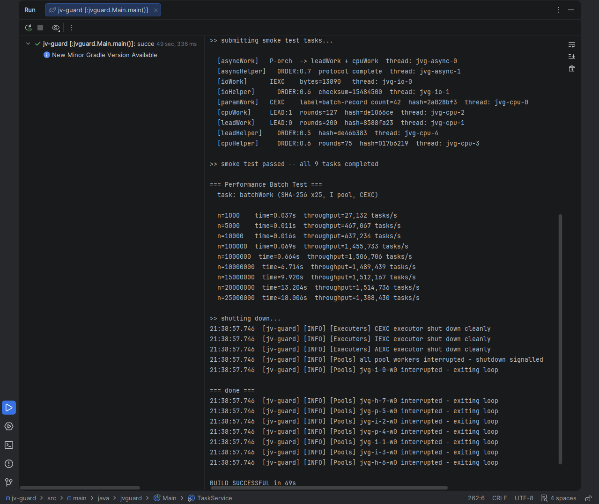

# jv-guard

Models task orchestration and threaded work. Methods decorated with `@Task` are registered at startup, validated before execution, and dispatched to typed thread pools via a priority-ordered queue system with no runtime reflection on the hot path.

Requires **JDK 21+** (virtual threads via Project Loom).

---

## Core concepts

| Concept           | What it does                                                                                                                                           |
|-------------------|--------------------------------------------------------------------------------------------------------------------------------------------------------|
| `@Task`           | Decorates a method for registration. Defines its pool, executor, identity, and ordering.                                                               |
| **Pool**          | A named core group (`I`, `P`, `H`, `R`). Tasks route to the pool they declare.                                                                         |
| **Executor**      | The thread model that runs the task (`CEXC` OS threads, `IEXC`/`AEXC` virtual threads).                                                                |
| **GROUP**         | Integer phase. Lower groups pull from queues before higher groups.                                                                                     |
| **ORDER**         | Float `[0.0, 1.0)` position within a GROUP. Determines pull order when multiple tasks share a group.                                                   |
| **LEAD**          | Pinnacle rank. LEAD tasks enter a skip-list back segment and always pull before front-queue tasks. LEAD `0` is highest priority.                       |
| **MIRROR**        | Typed producer-consumer chain. A producer's return value is captured and routed to a named consumer via `MirrorBus`. Types are validated at seal time. |
| `Wrapping.seal()` | Locks the registry. All validation runs here -- no task executes until seal passes clean.                                                              |

---

## Pools

| Tag | Purpose                                                   |
|-----|-----------------------------------------------------------|
| `I` | Idempotent work                                           |
| `P` | Protocol / orchestration                                  |
| `H` | Harmonic -- static difficulty class, variable actual cost |
| `R` | Command processing, hot-split from I pool cores           |

## Executors

| Tag    | Thread model                                            | Use for                               |
|--------|---------------------------------------------------------|---------------------------------------|
| `CEXC` | Fixed OS thread pool (sized to `availableProcessors()`) | CPU-bound work that must not yield    |
| `IEXC` | Virtual thread per task                                 | IO-bound work that blocks or parks    |
| `AEXC` | Virtual thread per task                                 | Async orchestration, MIRROR consumers |

---

## Quick start

```java
// 1. Annotate methods
class WorkService {

    @Task(POOL = "I", EXECUTER = "CEXC", OP = "crunchData", GROUP = 0, ORDER = 0.001)
    public void crunchData() { 'some_data_crunch'}

    @Task(POOL = "P", EXECUTER = "AEXC", OP = "orchestrate", GROUP = 0, ORDER = 0.001)
    public void orchestrate() {
        Handler.get().submit("crunchData");
    }
    
    public static void main() {

        // 2. Register and seal
        Wrapping.register(new WorkService());
        Wrapping.seal();

        // 3. Configure pools
        Pools.PoolConfig config = new Pools.PoolConfig.Builder()
                .iPool(2).pPool(1).hPool(2).rPool(0).workersPerCore(3).build();

        // 4. Start
        Handler.initialize(config);
        MirrorBus.initialize();
        Executers.start();

        // 5. Submit
        Handler.get().submit("orchestrate");

        // 6. Shutdown
        Executers.shutdown();
        Pools.getRegistry().shutdown();
        
    }
}

```

---

## @Task fields

| Field       | Type       | Required  | Default           | Description                                                            |
|-------------|------------|-----------|-------------------|------------------------------------------------------------------------|
| `POOL`      | `String`   | yes       | --                | `"I"`, `"P"`, `"H"`, or `"R"`                                          |
| `EXECUTER`  | `String`   | yes       | --                | `"CEXC"`, `"IEXC"`, or `"AEXC"`                                        |
| `OP`        | `String`   | yes       | --                | Unique task label used for routing and submission                      |
| `GROUP`     | `int`      | no        | `>=0`,            | Phase group -- lower runs first                                        |
| `ORDER`     | `double`   | no        | `<1.0`,           | Position within group -- must be in `[0.0, 1.0)`                       |
| `LEAD`      | `int`      | no        | `-1`              | Pinnacle rank -- `0` is highest, `-1` disables                         |
| `MIRROR`    | `String`   | no        | `""`              | OP of the consumer that receives this task's return value              |
| `CACHE`     | `boolean`  | no        | `true`            | Pre-compile a `MethodHandle` at seal time for the hot invocation path  |
| `STATE_LOCK`| `boolean`  | no        | `false`           | Fulfill this lead when applying group phase or order if workers remain |
---

## Parameterized tasks

Methods with parameters use a same-named static `Object[]` constant on the same class. Arguments are pre-bound into the `MethodHandle` at seal time -- the invocation path stays no-arg.

```java
static final Object[] processRecord = { "input-key", 42 };

@Task(POOL = "I", EXECUTER = "CEXC", OP = "processRecord", GROUP = 0, ORDER = 0.002)
public void processRecord(String key, int count) { }
```

---

## MIRROR chains

A MIRROR producer declares the OP of its consumer. The engine captures the return value after execution, routes it through `MirrorBus`, and auto-submits the consumer. Types are validated at `seal()` -- a mismatch anywhere in the chain is a hard block with the exact edge reported.

```java
@Task(POOL = "I", EXECUTER = "CEXC", OP = "buildResult",
        GROUP = 0, ORDER = 0.001, MIRROR = "processResult")
public String buildResult() { return "computed"; }

// Must be AEXC or IEXC -- CEXC would block an OS thread on the bus wait
@Task(POOL = "P", EXECUTER = "AEXC", OP = "processResult", GROUP = 0, ORDER = 0.5)
public void processResult(String value) { }
```

Chains can be arbitrarily long. A mid-chain node that both receives input and returns output is supported. The full type graph is proven at seal time.

---

## LEAD tasks

LEAD tasks bypass the front priority queue and always pull before any GROUP/ORDER task. Multiple concurrent submissions of the same LEAD integer are disambiguated by dynamically allocated suffixes, released and recycled on completion.

```java
@Task(POOL = "I", EXECUTER = "CEXC", OP = "priorityWork",
        GROUP = 0, ORDER = 0.001, LEAD = 0)
public void priorityWork() { }
```

LEAD `0` always pulls before LEAD `1`, `2`, and so on.

---

## Annotation Fields

### `STATE_LOCK` _(boolean, default: `true`)_

Controls whether a `LEAD` task participates in GROUP phase ordering.

| Value   | Behaviour                                                                                                                                                                                                                                                                                                                                                  |
|---------|------------------------------------------------------------------------------------------------------------------------------------------------------------------------------------------------------------------------------------------------------------------------------------------------------------------------------------------------------------|
| `true`  | **Stateful lead.** Enters the back skip-list and is dispatched in LEAD / ORDER priority order, respecting GROUP phase. MIRROR producer-consumer chains work normally on this path.                                                                                                                                                                         |
| `false` | **Stateless lead.** Bypasses the skip-list and GROUP phase entirely. Dispatched directly to any free (idle/parked) worker via work signal. Multiple stateless leads fan out in parallel across available workers — no phase gate, no suffix allocated. Use for idempotent, order-independent LEAD work that should fill idle capacity as fast as possible. |

> Only meaningful when `LEAD >= 0`. Ignored on non-LEAD tasks (`LEAD == -1`).

```java
// Stateful — respects GROUP phase, safe for MIRROR chains
@Task(POOL = "P", EXECUTER = "CEXC", OP = "buildResult", LEAD = 0)
public void buildResult() { 'build_some_result' }

// Stateless — bypasses phase entirely, fans out to any free worker
@Task(POOL = "I", EXECUTER = "CEXC", OP = "hashChunk", LEAD = 0, STATE_LOCK = false)
public void hashChunk() { 'check_some_chunk' }
```

### `MIRROR` _(String, default: `""`)_

Declares this task as a producer in a MIRROR chain. The engine captures the return value after normal execution and routes it to the named consumer OP via the mirror bus. The consumer is auto-submitted once the value is available.

- The consumer must accept the producer's return type as its first parameter.
- Consumer `EXECUTER` must be `AEXC` or `IEXC` — `CEXC` blocks an OS thread awaiting the result, which is a Tier 1 violation at `seal()`.

```java
@Task(POOL = "P", EXECUTER = "CEXC", OP = "buildResult", MIRROR = "processResult")
public String buildResult() { return "value"; }

@Task(POOL = "P", EXECUTER = "AEXC", OP = "processResult")
public void processResult(String value) { 'process_some_strings' }
```

---

## Validation

`seal()` runs two tiers before any executor starts. **Tier 1** blocks on invalid `POOL`, `EXECUTER`, blank `OP`, negative `GROUP`, out-of-range `LEAD`, missing args constants, duplicate OP names, MIRROR type mismatches, and CEXC consumers. All violations are collected and thrown together. **Tier 2** silently defaults invalid `ORDER` on non-LEAD tasks to `0.0` with a warning; invalid `ORDER` on LEAD tasks is a hard block.

---

## Performance

Measured on a Ryzen 7800X3D (8 cores, SMT off):



---

## Demos

| File                       | What it covers                                                                               |
|----------------------------|----------------------------------------------------------------------------------------------|
| `Main.java`                | Smoke test (9-task graph) + throughput batch test                                            |
| `CompleteChaosTester.java` | rPool commands, two-step MIRROR, three-step MIRROR chain, concurrent LEAD storm, async wave  |
| `GroupSeries.java`         | GROUP-ordered MIRROR chain: Leibniz PI (100M terms) feeding Glaisher-Kinkelin A via Barnes G |

---

## Related

jv-guard is part of a multi-language threading engine family at [tavari.online](https://tavari.online).

| Project  | Language | Status      |
|----------|----------|-------------|
| tg-guard | Python   | Public      |
| jv-guard | Java     | This repo   |
| Invoke   | Go       | Public      |
| c-guard  | C        | In progress |